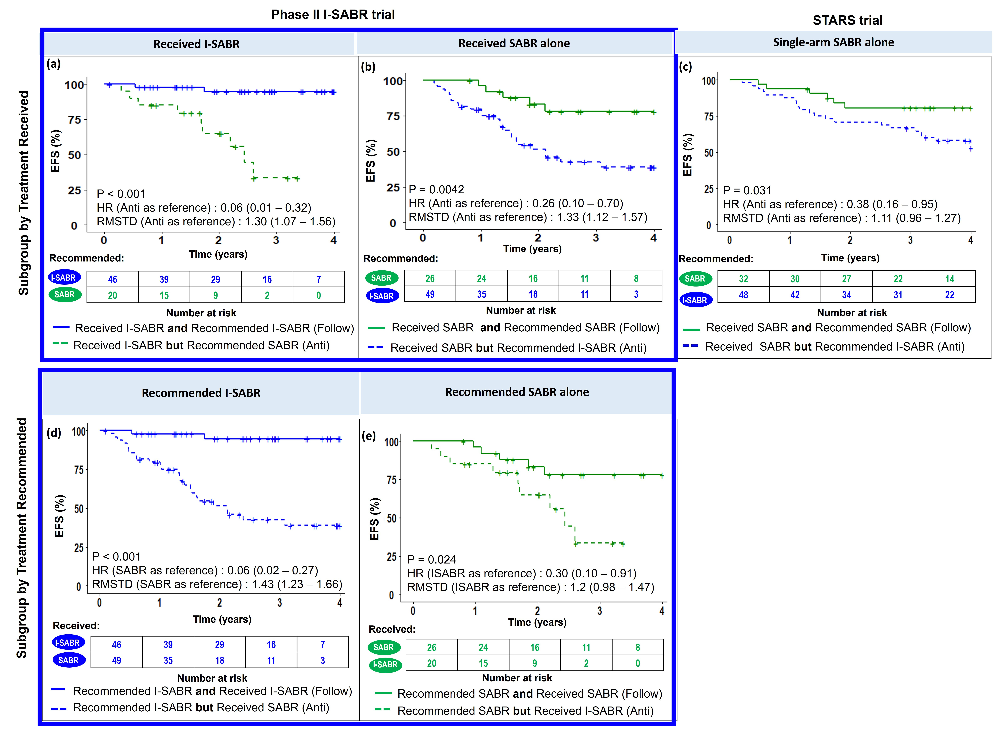

# I-SABR-SELECT: A Computational Tool for Personalized Treatment Decisions in SABR and I-SABR

**I-SABR-SELECT** is a computational framework that estimates the individualized treatment effect (ITE) for adding immunotherapy to stereotactic ablative radiotherapy (SABR) in patients with early-stage inoperable non-small cell lung cancer (NSCLC). By leveraging radiomic features extracted from contrast-enhanced CT imaging and clinical predictors, I-SABR-SELECT models heterogeneous treatment effects between I-SABR and SABR alone using counterfactual reasoning and machine learning techniques. The framework identifies patients who are most likely to benefit from immunotherapy while minimizing unnecessary treatment exposure for others.


## Key Features
- **Radiomics and Clinical Integration**: Combines 43 radiomic and 8 clinical predictors for precise patient stratification.
- **Counterfactual Reasoning**: Models treatment effects between SABR and I-SABR using individualized treatment effect (ITE) scores.
- **Robust Feature Selection**: Implements swarm intelligence (grey wolf optimizer) and cross-validation to identify predictive features.
- **External Validation**: Validated using data from the I-SABR randomized trial and STARS trial for generalizability.
- **Interpretability**: SHAP-based analysis quantifies the influence of clinical and radiomic predictors.

This repository holds the code for the I-SABR-SELECT framework, as described in [XXXXX]. 

### Installation
I-SABR-SELECT can be installed using following command to get the development version:
```r
remotes::install_github("WuLabMDA/I-SABR") 
```
Alternatively, I-SABR-SELECT can be cloned using the following command:

``` r
git clone https://github.com/WuLabMDA/I-SABR.git
```

### 1. **Model Training**
- **File**: `S1_Train_model.py`  
- **Description**: Trains the machine learning models using bootstrapping, feature selection, and survival analysis. Implements Grey Wolf Optimizer for feature reduction.  
- **Inputs**: `ISABR_trial.csv`, `matched_id.csv`, `unmatched_id.csv`  
- **Outputs**: Trained models and cross-validation results.

### 2. **Feature Selection and Visualization**
- **File**: `S2_BarPlot.py`  
- **Description**: Visualizes feature selection frequency across models. Generates bar plots and histograms to analyze selected features.  
- **Inputs**: Model outputs and feature metadata (`Type.xlsx`).  
- **Outputs**: Feature selection bar plots.

### 3. **Generate Predictions**
- **File**: `S3_Generate_predictions.py`  
- **Description**: Generates treatment predictions using the trained models. Predicts individualized treatment effects (ITE) for the I-SABR and STARS cohorts.  
- **Inputs**: Trained models and test data (`ISABR_trial.csv`, `STARS_trial.csv`).  
- **Outputs**: ITE predictions and treatment recommendation summaries.

### 4. **Refit Model for Subgroup Analysis**
- **File**: `S4_Refit.py`  
- **Description**: Refits the models to analyze treatment recommendations for different patient subgroups (SABR vs I-SABR). Computes survival statistics and treatment effects.  
- **Inputs**: ITE predictions and survival data.  
- **Outputs**: Subgroup analyses and validation results.

### 5. **SHAP Calculation**
- **File**: `S5_SHAP_calculation.py`  
- **Description**: Calculates SHAP values for feature importance analysis using Random Forest models. Identifies features contributing to treatment predictions.  
- **Inputs**: Trained models, validation data.  
- **Outputs**: SHAP values for all features.

### 6. **SHAP Plots and Interpretation**
- **File**: `S6_SHAP_plot.py`  
- **Description**: Generates SHAP visualizations (bar plots and summary plots) to interpret model predictions and feature contributions.  
- **Inputs**: SHAP values and validation data.  
- **Outputs**: Interpretability plots for feature importance and effect direction.

### 7. **Core Utilities**
- **Files**:  
   - `functionER.py`: Objective functions for feature selection and subgroup analysis.  
   - `function_recommend.py`: Functions for treatment recommendation, survival curves, and subgroup analyses.  
   - `gwo.py`: Implementation of the Grey Wolf Optimizer for feature selection.  

---

## Results
- **Treatment Recommendations**: I-SABR-SELECT identified a significant subgroup of patients benefiting from adding immunotherapy.
- **Improved Outcomes**: Patients treated following model recommendations demonstrated superior event-free survival (EFS) compared to random treatment assignment.
  


## Citation
If you use this framework, please cite our work:

```bibtex
@article{ISABRSelect,
  title={Artificial Intelligence-Based Clinical and Radiomic Analysis to Optimize Patient Selection for Combined Immunotherapy and SABR in Early-Stage NSCLC – Secondary Analysis of the I-SABR Randomized Controlled Trial},
  author={},
  journal={},
  year={Year},
  volume={Volume},
  pages={Pages},
  doi={DOI}
}
```

For questions, contributions, or issues, please contact us or create a new issue in this repository.
